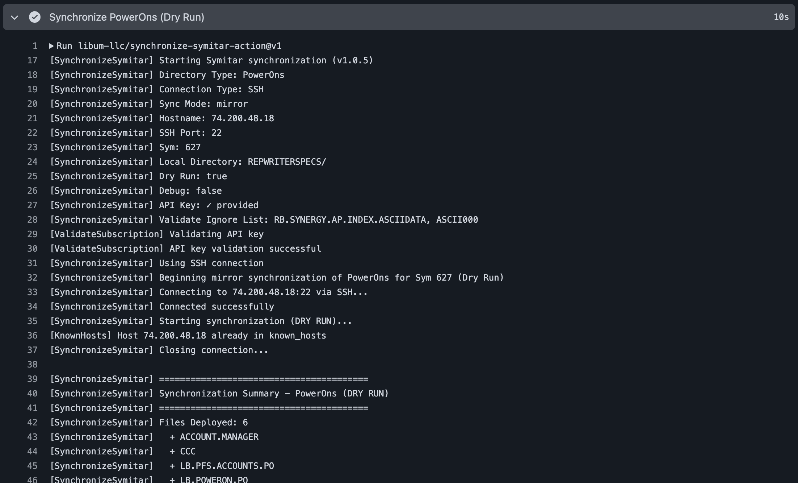

[](https://github.com/libum-llc/synchronize-symitar-action/releases/latest)
[](https://github.com/marketplace/actions/synchronize-symitar)
[](https://github.com/libum-llc/synchronize-symitar-action/actions?workflow=ci)

## About
GitHub Action to synchronize a directory on the Jack Henry™ credit union core platform




___

- [Usage](#usage)
  - [Basic Example](#basic-example)
  - [Using HTTPS Connection](#using-https-connection)
  - [Synchronizing Other Directory Types](#synchronizing-other-directory-types)
  - [Using Mirror Mode](#using-mirror-mode)
  - [Preserving Server-Managed Files](#preserving-server-managed-files)
  - [Pulling Preserved Files Back to Git](#pulling-preserved-files-back-to-git)
  - [Release Pipeline with Environment Approvals](#release-pipeline-with-environment-approvals)
- [List Inputs](#list-inputs)
- [Customizing](#customizing)
  - [Inputs](#inputs)
  - [Outputs](#outputs)
  - [Secrets](#secrets)
- [Contributing](#contributing)

## Usage

### Basic Example

```yaml
name: Deploy PowerOns

on:
  push:
    branches: [main]
    paths:
      - 'REPWRITERSPECS/**'

jobs:
  deploy:
    runs-on: self-hosted
    steps:
      - name: Checkout code
        uses: actions/checkout@v4

      - name: Synchronize PowerOns to Symitar
        uses: libum-llc/synchronize-symitar-action@v1
        with:
          directory-type: powerOns
          symitar-hostname: 93.455.43.232
          sym-number: 627
          symitar-user-number: 1995
          symitar-user-password: ${{ secrets.SYMITAR_USER_PASSWORD }}
          ssh-username: libum
          ssh-password: ${{ secrets.SSH_PASSWORD }}
          api-key: ${{ secrets.API_KEY }}
          sync-mode: push
          dry-run: false
          install-poweron-list: MYSPECFILE.PO,ANOTHERSPEC.PO
```

### Using HTTPS Connection

```yaml
jobs:
  deploy:
    runs-on: self-hosted
    steps:
      - name: Synchronize PowerOns via HTTPS
        uses: libum-llc/synchronize-symitar-action@v1
        with:
          directory-type: powerOns
          symitar-hostname: 93.455.43.232
          symitar-app-port: 42627
          sym-number: 627
          symitar-user-number: 1995
          symitar-user-password: ${{ secrets.SYMITAR_USER_PASSWORD }}
          ssh-username: libum
          ssh-password: ${{ secrets.SSH_PASSWORD }}
          api-key: ${{ secrets.API_KEY }}
          connection-type: https
          sync-mode: push
          dry-run: false
```

### Synchronizing Other Directory Types

```yaml
jobs:
  deploy:
    runs-on: self-hosted
    steps:
      - name: Synchronize LetterFiles
        uses: libum-llc/synchronize-symitar-action@v1
        with:
          directory-type: letterFiles
          symitar-hostname: 93.455.43.232
          sym-number: 627
          symitar-user-number: 1995
          symitar-user-password: ${{ secrets.SYMITAR_USER_PASSWORD }}
          ssh-username: libum
          ssh-password: ${{ secrets.SSH_PASSWORD }}
          api-key: ${{ secrets.API_KEY }}
          sync-mode: push
          dry-run: false
```

### Using Mirror Mode

Mirror mode makes Symitar match your local directory exactly, deleting any extra files on Symitar:

```yaml
jobs:
  deploy:
    runs-on: self-hosted
    steps:
      - name: Mirror PowerOns to Symitar
        uses: libum-llc/synchronize-symitar-action@v1
        with:
          directory-type: powerOns
          symitar-hostname: 93.455.43.232
          sym-number: 627
          symitar-user-number: 1995
          symitar-user-password: ${{ secrets.SYMITAR_USER_PASSWORD }}
          ssh-username: libum
          ssh-password: ${{ secrets.SSH_PASSWORD }}
          api-key: ${{ secrets.API_KEY }}
          sync-mode: mirror
          dry-run: false
```

### Preserving Server-Managed Files

Use `preserve-server-files` for files that are generated or forcibly updated by the server. In `push` and `mirror` mode, matched files are left unchanged on Symitar instead of being overwritten or deleted from the repository copy.

```yaml
jobs:
  deploy:
    runs-on: self-hosted
    steps:
      - name: Synchronize PowerOns while preserving server-managed files
        uses: libum-llc/synchronize-symitar-action@v1
        with:
          directory-type: powerOns
          symitar-hostname: 93.455.43.232
          sym-number: 627
          symitar-user-number: 1995
          symitar-user-password: ${{ secrets.SYMITAR_USER_PASSWORD }}
          ssh-username: libum
          ssh-password: ${{ secrets.SSH_PASSWORD }}
          api-key: ${{ secrets.API_KEY }}
          sync-mode: mirror
          dry-run: false
          preserve-server-files: |
            - RD.*
            - PFR.*
```

### Pulling Preserved Files Back to Git

Use `pull-preserved-only` when you want a workflow that only downloads preserved files from Symitar. If `preserve-server-files` is empty, the action exits without pulling anything.

When `commit-pulled-changes` is enabled, the action commits and pushes pulled changes after synchronization. No commit or push is performed during `dry-run`.

> **Important:** when `commit-branch` is set, the workflow must check out that same branch before running this action. Drift is computed against the working tree, and the action pushes the resulting commit to `commit-branch` — if the checked-out ref and `commit-branch` don't match, the diff would be measured against the wrong branch and the push would silently move that branch's content. The action enforces this by erroring out when HEAD doesn't match `commit-branch`. Set `actions/checkout@v4` with `ref: <same-as-commit-branch>` (or use a workflow input that drives both, as in the example below).

```yaml
jobs:
  pull-server-managed:
    runs-on: self-hosted
    permissions:
      contents: write
    steps:
      - name: Checkout code
        uses: actions/checkout@v4
        with:
          ref: main   # must match commit-branch below

      - name: Pull server-managed PowerOns
        uses: libum-llc/synchronize-symitar-action@v1
        with:
          directory-type: powerOns
          symitar-hostname: 93.455.43.232
          sym-number: 627
          symitar-user-number: 1995
          symitar-user-password: ${{ secrets.SYMITAR_USER_PASSWORD }}
          ssh-username: libum
          ssh-password: ${{ secrets.SSH_PASSWORD }}
          api-key: ${{ secrets.API_KEY }}
          sync-mode: pull
          dry-run: false
          preserve-server-files: |
            - RD.*
            - PFR.*
          pull-preserved-only: true
          commit-pulled-changes: true
          commit-branch: main
```

For workflows that need to run against more than one branch (e.g. a manually-dispatched pull that can target `main` or a release branch), drive both `checkout.ref` and `commit-branch` from a single input so they can never drift:

```yaml
on:
  workflow_dispatch:
    inputs:
      commit_branch:
        description: 'Branch to compare against and commit pulled changes to'
        type: string
        default: main

jobs:
  pull-server-managed:
    runs-on: self-hosted
    permissions:
      contents: write
    steps:
      - uses: actions/checkout@v4
        with:
          ref: ${{ inputs.commit_branch || 'main' }}

      - uses: libum-llc/synchronize-symitar-action@v1
        with:
          # ...creds...
          sync-mode: pull
          pull-preserved-only: true
          preserve-server-files: |
            - RD.*
            - PFR.*
          commit-pulled-changes: true
          commit-branch: ${{ inputs.commit_branch || 'main' }}
```

The `|| 'main'` fallback covers events that don't carry inputs (e.g. `schedule:`).

If the checked-out branch ever doesn't match `commit-branch`, the action will fail fast with a message like:

```
commit-branch is "main" but the checked-out branch is "feature-x".
These must match — drift is computed against the working tree, and pushing
to a different branch would silently move that branch's content.
Configure actions/checkout with ref: main.
```

The same error is raised when the workspace is in a detached HEAD state (e.g. checking out a tag without specifying a branch).

#### Drift Detection (Outliers)

When `sync-mode: pull` and `pull-preserved-only: true`, the action also reports **outliers**: server files that differ from your repo *and aren't matched by `preserve-server-files`*. These represent server-side drift outside the "server is source of truth" allowlist — typically unauthorized direct edits on Symitar that should have come through git.

Outliers are **not pulled** in `pull-preserved-only` mode (the whole point is to leave non-preserved files alone). They're surfaced as outputs so workflows can fail, notify, or open an issue.

```yaml
- id: pull
  uses: libum-llc/synchronize-symitar-action@v1
  with:
    # ...creds...
    sync-mode: pull
    pull-preserved-only: true
    preserve-server-files: |
      - RD.*
      - PFR.*

- name: Fail on server-side drift
  if: steps.pull.outputs.outliers-count != '0'
  run: |
    echo "::error::Server-side drift detected outside preserved patterns"
    echo "Files: ${{ steps.pull.outputs.outlier-files }}"
    exit 1
```

The action also emits a `core.warning` annotation when outliers are detected, so they show up in the run UI without any extra wiring.

### Release Pipeline with Environment Approvals

For credit unions running both a Stage and a Prod Symitar environment, this pattern uses GitHub Releases as the trigger and gates each deploy behind a required-reviewer approval. Each environment runs a dry-run first (no approval), then a real deploy that requires reviewer sign-off.

**Job graph**

```
release: published
   │
   ▼
[stage-dry-run]   environment: Stage-Preview   (no approval, dry-run: true)
   │
   ▼
[stage-deploy]    environment: Stage           (approval required, dry-run: false)
   │
   ▼
[prod-dry-run]    environment: Prod-Preview    (no approval, dry-run: true)
   │
   ▼
[prod-deploy]     environment: Prod            (approval required, dry-run: false)
```

**Setup requirements**

In repo Settings → Environments, create four environments:

| Environment | Required reviewers | Purpose |
|-------------|--------------------|---------|
| `Stage-Preview` | none | Dry-run preview against Stage Symitar |
| `Stage` | 1+ reviewers | Real deploy to Stage |
| `Prod-Preview` | none | Dry-run preview against Prod Symitar |
| `Prod` | 1+ reviewers | Real deploy to Prod |

> **Required reviewers are a paid feature on private repos.** They're free on public repos and on private repos under GitHub Pro / Team / Enterprise plans, but **not available on GitHub Free for private repos**. If you don't see a "Deployment protection rules" section under your environment, your plan/visibility combo doesn't include it. As a fallback, insert a manual-approval step (e.g. [`trstringer/manual-approval`](https://github.com/trstringer/manual-approval)) as the first step of each deploy job — it opens a GitHub Issue and blocks until an approver comments.

**Deployment branches and tags** (per environment, under "Selected branches and tags"):

| Environment | Allowed refs | Why |
|-------------|--------------|-----|
| `Stage-Preview`, `Stage` | branch `main` + tag pattern `v*` | Allows manual dispatch from `main` and release-triggered runs from tagged releases |
| `Prod-Preview`, `Prod` | tag pattern `v*` only | Forces every Prod deploy to be a tagged release |

If you don't enforce a tag convention, switch to "All branches and tags" — but tagged releases won't trigger if the tag pattern is wrong, so set this before cutting your first release. A common symptom of a misconfigured rule is `Tag v1.0.0 is not allowed to deploy to <env> due to environment protection rules` in the run logs.

**Variables and secrets** — credentials for each environment's Symitar:

| Type | Name | Notes |
|------|------|-------|
| Variable | `SYMITAR_HOSTNAME` | Hostname / IP for that environment's Sym |
| Variable | `SYM_NUMBER` | Sym number |
| Variable | `SYMITAR_USER_NUMBER` | Quest user number |
| Variable | `SYMITAR_APP_PORT` | SymAppServer port (typically `42` + sym number) |
| Variable | `SSH_USERNAME` | AIX SSH username |
| Secret | `SYMITAR_USER_PASSWORD` | Quest user password |
| Secret | `SYMITAR_PASSWORD` | AIX SSH password |
| Secret | `API_KEY` | PowerOn Pipelines API key |

You have two options for where these live:

1. **Environment-scoped** (recommended when Stage and Prod use *different* Symitar credentials): put them on each environment. Same values on `Stage-Preview` + `Stage`; same on `Prod-Preview` + `Prod`.
2. **Repo-level** (when both environments share one Symitar, e.g. a single Sym used for both staged validation and production): keep environments empty and add the values once at the repo level. The workflow resolves `secrets.*` / `vars.*` to repo-level values when no env-scoped equivalent exists.

**Workflow**

```yaml
# Before this workflow can run, configure four environments under Settings → Environments:
#   - Stage-Preview, Stage, Prod-Preview, Prod
# On `Stage` and `Prod`, enable Required reviewers (paid feature on private repos —
# requires GitHub Pro / Team / Enterprise; not available on Free for private repos).
# Set "Deployment branches and tags" on each environment to allow `main` + `v*` tags
# (Stage / Stage-Preview), or `v*` tags only (Prod / Prod-Preview).
# See the "Setup requirements" section above for the full credential matrix.
name: symitar-release

on:
  release:
    types: [published]
  workflow_dispatch:
    inputs:
      ref:
        description: 'Tag/branch/SHA to deploy'
        required: true
        default: 'main'
      target:
        description: 'Which segment to run'
        type: choice
        required: true
        default: all
        options: [all, stage, prod]

jobs:
  stage-dry-run:
    name: Stage (Dry Run)
    # Runs immediately on release-published, or on dispatch when target is `all` or `stage`.
    if: github.event_name == 'release' || inputs.target == 'all' || inputs.target == 'stage'
    runs-on: self-hosted
    environment: Stage-Preview  # No required reviewers — this is the unblocked preview.
    steps:
      - uses: actions/checkout@v4
        with:
          ref: ${{ github.event.release.tag_name || inputs.ref }}
      - uses: libum-llc/synchronize-symitar-action@v1
        with:
          directory-type: powerOns
          symitar-hostname: ${{ vars.SYMITAR_HOSTNAME }}
          sym-number: ${{ vars.SYM_NUMBER }}
          symitar-user-number: ${{ vars.SYMITAR_USER_NUMBER }}
          symitar-user-password: ${{ secrets.SYMITAR_USER_PASSWORD }}
          symitar-app-port: ${{ vars.SYMITAR_APP_PORT }}
          ssh-username: ${{ vars.SSH_USERNAME }}
          ssh-password: ${{ secrets.SYMITAR_PASSWORD }}
          api-key: ${{ secrets.API_KEY }}
          connection-type: https
          sync-mode: mirror
          dry-run: true
          preserve-server-files: |
            - RD.*
            - PFR.*

  stage-deploy:
    name: Stage (Deploy)
    # Default `needs:` semantics: runs only if stage-dry-run succeeded.
    # If stage-dry-run is skipped (e.g. target=prod) or fails, this job is auto-skipped.
    needs: stage-dry-run
    if: github.event_name == 'release' || inputs.target == 'all' || inputs.target == 'stage'
    runs-on: self-hosted
    environment: Stage  # Required reviewers configured here gate the real deploy.
    steps:
      - uses: actions/checkout@v4
        with:
          ref: ${{ github.event.release.tag_name || inputs.ref }}
      - uses: libum-llc/synchronize-symitar-action@v1
        with:
          directory-type: powerOns
          symitar-hostname: ${{ vars.SYMITAR_HOSTNAME }}
          sym-number: ${{ vars.SYM_NUMBER }}
          symitar-user-number: ${{ vars.SYMITAR_USER_NUMBER }}
          symitar-user-password: ${{ secrets.SYMITAR_USER_PASSWORD }}
          symitar-app-port: ${{ vars.SYMITAR_APP_PORT }}
          ssh-username: ${{ vars.SSH_USERNAME }}
          ssh-password: ${{ secrets.SYMITAR_PASSWORD }}
          api-key: ${{ secrets.API_KEY }}
          connection-type: https
          sync-mode: mirror
          dry-run: false
          preserve-server-files: |
            - RD.*
            - PFR.*

  prod-dry-run:
    name: Prod (Dry Run)
    # Two distinct run modes:
    #   1. target=prod — start immediately, regardless of stage-deploy status (stage was skipped on purpose).
    #   2. release/target=all — only proceed if stage-deploy succeeded. A failed Stage stops Prod.
    # `always()` is required so the if is evaluated when the upstream `stage-deploy` was skipped.
    needs: stage-deploy
    if: |
      always()
      && (
        inputs.target == 'prod'
        || ((github.event_name == 'release' || inputs.target == 'all') && needs.stage-deploy.result == 'success')
      )
    runs-on: self-hosted
    environment: Prod-Preview
    steps:
      - uses: actions/checkout@v4
        with:
          ref: ${{ github.event.release.tag_name || inputs.ref }}
      - uses: libum-llc/synchronize-symitar-action@v1
        with:
          directory-type: powerOns
          symitar-hostname: ${{ vars.SYMITAR_HOSTNAME }}
          sym-number: ${{ vars.SYM_NUMBER }}
          symitar-user-number: ${{ vars.SYMITAR_USER_NUMBER }}
          symitar-user-password: ${{ secrets.SYMITAR_USER_PASSWORD }}
          symitar-app-port: ${{ vars.SYMITAR_APP_PORT }}
          ssh-username: ${{ vars.SSH_USERNAME }}
          ssh-password: ${{ secrets.SYMITAR_PASSWORD }}
          api-key: ${{ secrets.API_KEY }}
          connection-type: https
          sync-mode: mirror
          dry-run: true
          preserve-server-files: |
            - RD.*
            - PFR.*

  prod-deploy:
    name: Prod (Deploy)
    # Default `needs:` semantics: runs only if prod-dry-run succeeded.
    needs: prod-dry-run
    if: github.event_name == 'release' || inputs.target == 'all' || inputs.target == 'prod'
    runs-on: self-hosted
    environment: Prod  # Required reviewers configured here — typically a tighter list than Stage.
    steps:
      - uses: actions/checkout@v4
        with:
          ref: ${{ github.event.release.tag_name || inputs.ref }}
      - uses: libum-llc/synchronize-symitar-action@v1
        with:
          directory-type: powerOns
          symitar-hostname: ${{ vars.SYMITAR_HOSTNAME }}
          sym-number: ${{ vars.SYM_NUMBER }}
          symitar-user-number: ${{ vars.SYMITAR_USER_NUMBER }}
          symitar-user-password: ${{ secrets.SYMITAR_USER_PASSWORD }}
          symitar-app-port: ${{ vars.SYMITAR_APP_PORT }}
          ssh-username: ${{ vars.SSH_USERNAME }}
          ssh-password: ${{ secrets.SYMITAR_PASSWORD }}
          api-key: ${{ secrets.API_KEY }}
          connection-type: https
          sync-mode: mirror
          dry-run: false
          preserve-server-files: |
            - RD.*
            - PFR.*
```

**Behavior summary**

- Cutting a GitHub Release runs the full chain: Stage dry-run → Stage approval → Stage deploy → Prod dry-run → Prod approval → Prod deploy.
- `workflow_dispatch` with `target: stage` or `target: prod` runs only that segment against any tag, branch, or SHA without cutting a release. `target: prod` skips Stage entirely.
- A **failed** dry-run or deploy stops the chain — downstream jobs are skipped (not run).
- An **intentionally skipped** Stage (when `target: prod`) does not block Prod from running.

## List Inputs

`install-poweron-list`, `validate-ignore-list`, and `preserve-server-files` accept either a comma-delimited string or a YAML list (one item per line, optionally `- ` prefixed). YAML list form is recommended when you have more than a handful of entries — it stays readable as the list grows.

```yaml
# Comma-delimited (good for short lists)
preserve-server-files: RD.*, PFR.*

# Multi-line (one item per line)
preserve-server-files: |
  RD.*
  PFR.*

# YAML block-sequence (mirrors poweron.yml conventions)
preserve-server-files: |
  - RD.*
  - PFR.*
```

## Customizing

### Inputs

| Input | Description | Required | Default |
|-------|-------------|----------|---------|
| `directory-type` | Type of Symitar directory: `powerOns`, `letterFiles`, `dataFiles`, `helpFiles` | Yes | - |
| `symitar-hostname` | The endpoint by which you connect to the Symitar host | Yes | - |
| `sym-number` | The directory (aka Sym) number for your connection | Yes | - |
| `symitar-user-number` | Your Symitar Quest user number (just the number) | Yes | - |
| `symitar-user-password` | Your Symitar Quest password (just the password) | Yes | - |
| `ssh-username` | The AIX user name for the Symitar host | Yes | - |
| `ssh-password` | The AIX password for the Symitar host | Yes | - |
| `ssh-port` | The port to connect to the SSH server | No | `22` |
| `api-key` | Your PowerOn Pipelines API Key from [Libum Portal](https://portal.libum.io) | Yes | - |
| `symitar-app-port` | The port which your SymAppServer communicates over. This is typically `42` + `symNumber` | No | - |
| `connection-type` | Connection type: `https` or `ssh` | No | `ssh` |
| `local-directory-path` | Local directory path containing files to synchronize | No | `REPWRITERSPECS/` (powerOns), `LETTERSPECS/` (letterFiles), `DATAFILES/` (dataFiles), `HELPFILES/` (helpFiles) |
| `sync-mode` | Synchronization mode: `push` (upload), `pull` (download), or `mirror` (exact sync) | Yes | - |
| `sync-method` | Transport method for file synchronization: `sftp` or `rsync` | No | `sftp` |
| `sftp-concurrency` | Number of concurrent SFTP transfers (1-20). Only applies when `sync-method` is `sftp` | No | `4` |
| `dry-run` | If `true`, shows proposed changes without applying them | No | `true` |
| `install-poweron-list` | List of PowerOn files to install after sync. Accepts comma-delimited or YAML list — see [List Inputs](#list-inputs). Only applies to `powerOns`. | No | `''` |
| `validate-ignore-list` | List of PowerOn files to skip validation for. Accepts comma-delimited or YAML list — see [List Inputs](#list-inputs). | No | `''` |
| `preserve-server-files` | List of exact filenames or glob patterns where the server copy should be preserved during `push` or `mirror`. Accepts comma-delimited or YAML list — see [List Inputs](#list-inputs). | No | `''` |
| `pull-preserved-only` | When `sync-mode` is `pull`, only pull files matched by `preserve-server-files`. If no preserve files are configured, the action exits without pulling files. | No | `false` |
| `commit-pulled-changes` | When `sync-mode` is `pull`, commit and push pulled workspace changes after synchronization. No commit is created during `dry-run`. | No | `false` |
| `commit-message` | Commit message used when `commit-pulled-changes` is enabled | No | `chore: sync server-managed Symitar files [skip ci]` |
| `commit-branch` | Branch to push the commit to. Defaults to the checked-out branch. | No | `''` |
| `git-user-name` | Git author name used when `commit-pulled-changes` is enabled | No | `libum-bot` |
| `git-user-email` | Git author email used when `commit-pulled-changes` is enabled | No | `bot@libum.io` |
| `debug` | Enable debug logging for Symitar clients | No | `false` |

### Outputs

| Output | Description |
|--------|-------------|
| `files-deployed` | Number of files deployed (added/updated) |
| `files-deleted` | Number of files deleted |
| `files-installed` | Number of PowerOn files installed (only for `powerOns`) |
| `files-uninstalled` | Number of PowerOn files uninstalled (only for `powerOns`) |
| `outliers-count` | Number of server files that differ from local but are NOT preserve-matched (drift detection). Only populated when `sync-mode` is `pull` and `pull-preserved-only` is `true`. |
| `outlier-files` | JSON array of outlier file names |

### Secrets

The following secrets should be configured in your repository:

- `SYMITAR_USER_PASSWORD` - Your Symitar Quest password (just the password)
- `SSH_PASSWORD` - The AIX password for the Symitar host
- `API_KEY` - Your PowerOn Pipelines API Key from [Libum Portal](https://portal.libum.io)

## Contributing
We at [Libum](https://libum.io) are committed to improving the software development process of Jack Henry™ credit unions. The best way for you to contribute / get involved is communicate ways we can improve the Synchronize Symitar Action feature set.

Please share your thoughts with us through our [Feedback Portal](https://feedback.libum.io), on our [Libum Community](https://discord.gg/libum) Discord, or at [development@libum.io](mailto:development@libum.io)
