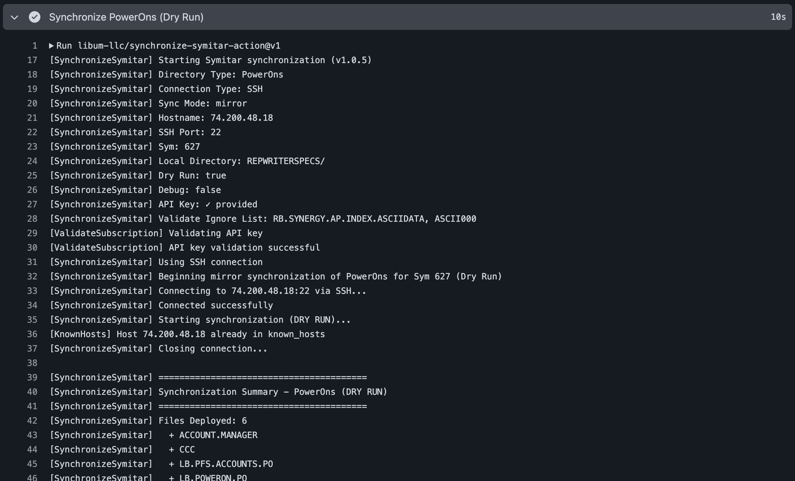

[](https://github.com/libum-llc/synchronize-symitar-action/releases/latest)
[](https://github.com/marketplace/actions/synchronize-symitar)
[](https://github.com/libum-llc/synchronize-symitar-action/actions?workflow=ci)

## About

GitHub Action to synchronize a directory on the Jack Henry™ credit union core platform



---

## v2.0.0: Upgrading from v1

**No input or output was removed, renamed, or given a different default**, and
the major bump is not about the interface. One behavior change does need
checking before you switch `@v1` to `@v2`, though — see *Boolean inputs are now
strict* below.

What changed is everything behind it. The synchronization logic is no longer
implemented in this repository: it now comes from
[`@libum-llc/pipelines-core`](https://github.com/libum-llc/poweron-pipelines/tree/main/packages/core),
the same host-agnostic package the PowerOn Pipelines Azure DevOps extension
runs on. This repo is reduced to the GitHub-specific wiring around it, so the
two stay in step by construction rather than by hand.

Three consequences worth knowing about before you upgrade:

1. **Synchronization is now transactional.** Core snapshots the files a run is
   about to mutate and restores them if the run fails partway through, instead
   of leaving the host half-synchronized. A failure that v1 would have left in
   place is now rolled back and re-reported.

2. **Failure messages and log output are different.** Core uses a typed error
   hierarchy and a structured logger, so the text your job summaries and log
   greps see has changed. Nothing about *which* runs fail changed — only how
   the failure reads.

3. **The action runs on Node 24.** GitHub has deprecated `node20` for actions
   and already executes `node20` actions on Node 24, so this only removes the
   deprecation warning. No runner change is needed.

New in v2, both opt-in and off by default: opening a pull request instead of
committing pulled changes directly (see
[Opening a Pull Request Instead of Committing](#opening-a-pull-request-instead-of-committing)),
and `skip-validation` for pushes and mirrors of `powerOns`.

### Boolean inputs are now strict

`dry-run`, `skip-validation`, `pull-preserved-only`, `commit-pulled-changes`,
`create-pull-request` and `debug` are parsed with `@actions/core`'s
`getBooleanInput`, which accepts only `true`, `True`, `TRUE`, `false`, `False`
and `FALSE`. v1 compared the raw string to `'true'`, so **every other spelling
silently meant `false`**. Two consequences when upgrading:

- **`yes`, `1`, `on`, `y` now fail the step** with a `TypeError` instead of
  being read as `false`. Loud, and easy to fix.
- **`TRUE`, `True` flip from `false` to `true`.** This one is silent, so it is
  the one to grep for. `dry-run: True` was a *live* run under v1 and is a dry
  run under v2 — harmless. `skip-validation: TRUE` and
  `pull-preserved-only: TRUE` flip the other way: they were inert in v1 and now
  actually take effect, changing what gets validated and what gets pulled.

Search your workflows for these six inputs and confirm every value is
lowercase `true` or `false`.

- [Usage](#usage)
  - [Basic Example](#basic-example)
  - [Using HTTPS Connection](#using-https-connection)
  - [Synchronizing Other Directory Types](#synchronizing-other-directory-types)
  - [Using Mirror Mode](#using-mirror-mode)
  - [Preserving Server-Managed Files](#preserving-server-managed-files)
  - [Pulling Preserved Files Back to Git](#pulling-preserved-files-back-to-git)
  - [Opening a Pull Request Instead of Committing](#opening-a-pull-request-instead-of-committing)
  - [Drift Detection](#drift-detection)
  - [Release Pipeline with Environment Approvals](#release-pipeline-with-environment-approvals)
- [List Inputs](#list-inputs)
- [Customizing](#customizing)
  - [Inputs](#inputs)
  - [Outputs](#outputs)
  - [Secrets](#secrets)
- [Contributing](#contributing)

## Usage

This action must run on a self-hosted runner with network access to the Symitar host.
The examples below use `runs-on: self-hosted`; if your organization uses runner labels,
include the label for the runner that can reach Symitar.

### Basic Example

```yaml
name: Deploy PowerOns

on:
  push:
    branches: [main]
    paths:
      - 'REPWRITERSPECS/**'

jobs:
  deploy:
    runs-on: self-hosted
    steps:
      - name: Checkout code
        uses: actions/checkout@v4

      - name: Synchronize PowerOns
        uses: libum-llc/synchronize-symitar-action@v2
        with:
          directory-type: powerOns
          symitar-hostname: 93.455.43.232
          sym-number: 627
          symitar-user-number: 1995
          symitar-user-password: ${{ secrets.SYMITAR_USER_PASSWORD }}
          ssh-username: libum
          ssh-password: ${{ secrets.SSH_PASSWORD }}
          api-key: ${{ secrets.API_KEY }}
          sync-mode: push
          dry-run: false
```

### Using HTTPS Connection

```yaml
jobs:
  deploy:
    runs-on: self-hosted
    steps:
      - name: Synchronize PowerOns (HTTPS)
        uses: libum-llc/synchronize-symitar-action@v2
        with:
          directory-type: powerOns
          symitar-hostname: 93.455.43.232
          symitar-app-port: 42627
          sym-number: 627
          symitar-user-number: 1995
          symitar-user-password: ${{ secrets.SYMITAR_USER_PASSWORD }}
          ssh-username: libum
          ssh-password: ${{ secrets.SSH_PASSWORD }}
          api-key: ${{ secrets.API_KEY }}
          connection-type: https
          sync-mode: push
          dry-run: false
```

### Synchronizing Other Directory Types

```yaml
jobs:
  deploy:
    runs-on: self-hosted
    steps:
      - name: Synchronize LetterFiles
        uses: libum-llc/synchronize-symitar-action@v2
        with:
          directory-type: letterFiles
          symitar-hostname: 93.455.43.232
          sym-number: 627
          symitar-user-number: 1995
          symitar-user-password: ${{ secrets.SYMITAR_USER_PASSWORD }}
          ssh-username: libum
          ssh-password: ${{ secrets.SSH_PASSWORD }}
          api-key: ${{ secrets.API_KEY }}
          sync-mode: push
          dry-run: false
```

Supported `directory-type` values are `powerOns`, `letterFiles`, `dataFiles`, and `helpFiles`.
Use `local-directory-path` when your repo path does not match the default for that type.

### Using Mirror Mode

Mirror mode makes Symitar match the local directory, including deleting extra files on Symitar.

```yaml
jobs:
  deploy:
    runs-on: self-hosted
    steps:
      - name: Mirror PowerOns
        uses: libum-llc/synchronize-symitar-action@v2
        with:
          directory-type: powerOns
          symitar-hostname: 93.455.43.232
          sym-number: 627
          symitar-user-number: 1995
          symitar-user-password: ${{ secrets.SYMITAR_USER_PASSWORD }}
          ssh-username: libum
          ssh-password: ${{ secrets.SSH_PASSWORD }}
          api-key: ${{ secrets.API_KEY }}
          sync-mode: mirror
          dry-run: false
```

### Preserving Server-Managed Files

Use `preserve-server-files` for generated or server-managed files. In `push` and `mirror` mode, matching server files are not overwritten or deleted.

```yaml
jobs:
  deploy:
    runs-on: self-hosted
    steps:
      - name: Mirror PowerOns while preserving server-managed files
        uses: libum-llc/synchronize-symitar-action@v2
        with:
          directory-type: powerOns
          symitar-hostname: 93.455.43.232
          sym-number: 627
          symitar-user-number: 1995
          symitar-user-password: ${{ secrets.SYMITAR_USER_PASSWORD }}
          ssh-username: libum
          ssh-password: ${{ secrets.SSH_PASSWORD }}
          api-key: ${{ secrets.API_KEY }}
          sync-mode: mirror
          dry-run: false
          preserve-server-files: |
            - RD.*
            - PFR.*
```

### Pulling Preserved Files Back to Git

Use `pull-preserved-only` to download only files matched by `preserve-server-files`. Enable `commit-pulled-changes` when the action should commit and push those changes.

```yaml
on:
  workflow_dispatch:
    inputs:
      commit_branch:
        description: Branch to compare against and commit pulled changes to
        type: string
        default: main

jobs:
  pull-server-managed:
    runs-on: self-hosted
    permissions:
      contents: write
    steps:
      - name: Checkout code
        uses: actions/checkout@v4
        with:
          ref: ${{ inputs.commit_branch || 'main' }}

      - name: Pull server-managed PowerOns
        uses: libum-llc/synchronize-symitar-action@v2
        with:
          directory-type: powerOns
          symitar-hostname: 93.455.43.232
          sym-number: 627
          symitar-user-number: 1995
          symitar-user-password: ${{ secrets.SYMITAR_USER_PASSWORD }}
          ssh-username: libum
          ssh-password: ${{ secrets.SSH_PASSWORD }}
          api-key: ${{ secrets.API_KEY }}
          sync-mode: pull
          dry-run: false
          preserve-server-files: |
            - RD.*
            - PFR.*
          pull-preserved-only: true
          commit-pulled-changes: true
          commit-branch: ${{ inputs.commit_branch || 'main' }}
```

When `commit-branch` is set, `actions/checkout` must check out the same branch. Drive both values from the same input or variable so they cannot drift. The action fails if the checked-out branch and `commit-branch` do not match.

### Opening a Pull Request Instead of Committing

For protected branches, set `create-pull-request: true` instead of `commit-pulled-changes`. The action commits the pulled changes to `pull-request-branch`, force-pushes it with `--force-with-lease`, and opens a pull request into `pull-request-target-branch` — or reuses the pull request that is already open for that same head and base, so a scheduled workflow does not accumulate duplicates.

`create-pull-request` and `commit-pulled-changes` are mutually exclusive, and both require `sync-mode: pull`. Neither does anything during a dry run.

```yaml
jobs:
  pull-server-managed:
    runs-on: self-hosted
    permissions:
      contents: write
      # Required. The default GITHUB_TOKEN cannot open a pull request without
      # it, and the run fails rather than silently skipping the pull request.
      pull-requests: write
    steps:
      - name: Checkout code
        uses: actions/checkout@v4
        with:
          # Required so the action can push the pull request branch.
          fetch-depth: 0

      - name: Pull server-managed PowerOns
        uses: libum-llc/synchronize-symitar-action@v2
        with:
          directory-type: powerOns
          symitar-hostname: 93.455.43.232
          sym-number: 627
          symitar-user-number: 1995
          symitar-user-password: ${{ secrets.SYMITAR_USER_PASSWORD }}
          ssh-username: libum
          ssh-password: ${{ secrets.SSH_PASSWORD }}
          api-key: ${{ secrets.API_KEY }}
          sync-mode: pull
          dry-run: false
          preserve-server-files: |
            - RD.*
            - PFR.*
          pull-preserved-only: true
          create-pull-request: true
          pull-request-branch: chore/symitar-pull
          pull-request-target-branch: main
          pull-request-title: 'chore: sync server-managed Symitar files'
          pull-request-body: 'Auto-generated pull of server-managed Symitar files.'
          github-token: ${{ secrets.GITHUB_TOKEN }}
```

`pull-request-branch` must differ from `pull-request-target-branch`. When a pull request is opened or reused, the run publishes `pull-request-id` and `pull-request-url`; when the pull produced nothing to commit, or the run was a dry run, neither output is published.

If your organization requires pull requests to be opened by a real account (for example so that branch protection's "require review from someone other than the author" applies), pass a PAT with `pull-requests: write` as `github-token` instead of `secrets.GITHUB_TOKEN`.

> **Check out the target branch.** `pull-request-branch` is created from whatever
> `actions/checkout` put in the workspace, and is never rebased onto
> `pull-request-target-branch`. If the job checks out `develop` and targets
> `main`, the pull request contains the pulled Symitar files *and* every commit
> by which `develop` diverges from `main`. Check out the branch you are targeting
> — or set `pull-request-target-branch` to the branch you checked out.

### Drift Detection

When `sync-mode: pull` and `pull-preserved-only: true`, the action reports server files that differ from git but do not match `preserve-server-files`. These outliers are not pulled.

```yaml
jobs:
  detect-drift:
    runs-on: self-hosted
    steps:
      - id: pull
        uses: libum-llc/synchronize-symitar-action@v2
        with:
          directory-type: powerOns
          symitar-hostname: 93.455.43.232
          sym-number: 627
          symitar-user-number: 1995
          symitar-user-password: ${{ secrets.SYMITAR_USER_PASSWORD }}
          ssh-username: libum
          ssh-password: ${{ secrets.SSH_PASSWORD }}
          api-key: ${{ secrets.API_KEY }}
          sync-mode: pull
          pull-preserved-only: true
          preserve-server-files: |
            - RD.*
            - PFR.*

      - name: Fail on server-side drift
        if: steps.pull.outputs.outliers-count != '0'
        run: |
          echo "::error::Server-side drift detected outside preserved patterns"
          echo "Files: ${{ steps.pull.outputs.outlier-files }}"
          exit 1
```

### Release Pipeline with Environment Approvals

For production deployments, use a protected GitHub Environment so releases require approval before the job can reach Symitar.

```yaml
name: Release PowerOns

on:
  workflow_dispatch:
    inputs:
      release_branch:
        description: Branch to deploy
        type: string
        default: main
      dry_run:
        description: Preview changes without writing to Symitar
        type: boolean
        default: true

jobs:
  release:
    runs-on: self-hosted
    environment: production-symitar
    permissions:
      contents: read
    steps:
      - name: Checkout release branch
        uses: actions/checkout@v4
        with:
          ref: ${{ inputs.release_branch || 'main' }}

      - name: Release PowerOns
        uses: libum-llc/synchronize-symitar-action@v2
        with:
          directory-type: powerOns
          symitar-hostname: ${{ vars.SYMITAR_HOSTNAME }}
          sym-number: ${{ vars.SYM_NUMBER }}
          symitar-user-number: ${{ secrets.SYMITAR_USER_NUMBER }}
          symitar-user-password: ${{ secrets.SYMITAR_USER_PASSWORD }}
          ssh-username: ${{ secrets.SSH_USERNAME }}
          ssh-password: ${{ secrets.SSH_PASSWORD }}
          api-key: ${{ secrets.API_KEY }}
          sync-mode: push
          dry-run: ${{ inputs.dry_run }}
          preserve-server-files: |
            - RD.*
            - PFR.*
```

GitHub setup requirements:

- Create a self-hosted runner that can reach the Symitar host over SSH or HTTPS.
- Create a GitHub Environment such as `production-symitar` and configure required reviewers.
- Store non-secret deployment values as environment or repository variables, such as `SYMITAR_HOSTNAME` and `SYM_NUMBER`.
- Store credentials as environment or repository secrets: `SYMITAR_USER_NUMBER`, `SYMITAR_USER_PASSWORD`, `SSH_USERNAME`, `SSH_PASSWORD`, and `API_KEY`.
- Grant only the permissions the workflow needs. A push-only release usually needs `contents: read`; workflows that commit pulled files back need `contents: write`.

## List Inputs

`install-poweron-list`, `validate-ignore-list`, and `preserve-server-files` accept either a comma-delimited string or a YAML list.

```yaml
# Comma-delimited
preserve-server-files: RD.*, PFR.*

# Multi-line
preserve-server-files: |
  RD.*
  PFR.*

# YAML block-sequence
preserve-server-files: |
  - RD.*
  - PFR.*
```

## Customizing

### Inputs

| Input                   | Description                                                                                                       | Required | Default                                              |
| ----------------------- | ----------------------------------------------------------------------------------------------------------------- | -------- | ---------------------------------------------------- |
| `directory-type`        | Type of Symitar directory: `powerOns`, `letterFiles`, `dataFiles`, `helpFiles`                                    | Yes      | -                                                    |
| `symitar-hostname`      | The endpoint by which you connect to the Symitar host                                                             | Yes      | -                                                    |
| `sym-number`            | The directory (aka Sym) number for your connection. A whole number between 0 and 999; anything else is rejected as a typo. | Yes      | -                                                    |
| `symitar-user-number`   | Your Symitar Quest user number                                                                                    | Yes      | -                                                    |
| `symitar-user-password` | Your Symitar Quest password                                                                                       | Yes      | -                                                    |
| `ssh-username`          | The AIX user name for the Symitar host                                                                            | Yes      | -                                                    |
| `ssh-password`          | The AIX password for the Symitar host                                                                             | Yes      | -                                                    |
| `ssh-port`              | The port to connect to the SSH server                                                                             | No       | `22`                                                 |
| `api-key`               | Your PowerOn Pipelines API Key from [Libum Portal](https://portal.libum.io)                                       | Yes      | -                                                    |
| `symitar-app-port`      | SymAppServer port. Typically `42` + `symNumber`. **Required when `connection-type` is `https`** — the run fails on input validation, before the Symitar host is contacted. | No       | -                                                    |
| `connection-type`       | Connection type: `https` or `ssh`                                                                                 | No       | `ssh`                                                |
| `local-directory-path`  | Local directory path containing files to synchronize                                                              | No       | Standard path for the selected directory type        |
| `sync-mode`             | Synchronization mode: `push`, `pull`, or `mirror`                                                                 | Yes      | -                                                    |
| `skip-validation`       | Skip PowerOn validation before a push or mirror. Only applies to `powerOns`. **Validation is not skipped by `dry-run`** — see the note below.                     | No       | `false`                                              |
| `sync-method`           | Transport method: `sftp` or `rsync`                                                                               | No       | `sftp`                                               |
| `sftp-concurrency`      | Number of concurrent SFTP transfers. Only applies when `sync-method` is `sftp`                                    | No       | `4`                                                  |
| `dry-run`               | Shows proposed changes without applying them                                                                      | No       | `true`                                               |
| `install-poweron-list`  | PowerOn files to install after sync. Accepts comma-delimited or YAML list. Only applies to `powerOns`.            | No       | `''`                                                 |
| `validate-ignore-list`  | PowerOn files to skip validation for. Accepts comma-delimited or YAML list.                                       | No       | `''`                                                 |
| `preserve-server-files` | Exact filenames or glob patterns where the server copy should be preserved. Accepts comma-delimited or YAML list. | No       | `''`                                                 |
| `pull-preserved-only`   | When `sync-mode` is `pull`, only pull files matched by `preserve-server-files`                                    | No       | `false`                                              |
| `commit-pulled-changes` | When `sync-mode` is `pull`, commit and push pulled workspace changes after synchronization                        | No       | `false`                                              |
| `commit-message`        | Commit message used when `commit-pulled-changes` is enabled                                                       | No       | `chore: sync server-managed Symitar files [skip ci]` |
| `commit-branch`         | Branch to push the commit to. Leave unset to push the checked-out branch to its own upstream; when set, `actions/checkout` must have checked out that same branch. | No       | `''`                                                 |
| `git-user-name`         | Git author name used when `commit-pulled-changes` is enabled                                                      | No       | `libum-bot`                                          |
| `git-user-email`        | Git author email used when `commit-pulled-changes` is enabled                                                     | No       | `bot@libum.io`                                       |
| `create-pull-request`   | When `sync-mode` is `pull`, commit to `pull-request-branch` and open (or reuse) a pull request instead of pushing to `commit-branch`. Requires `github-token`. Mutually exclusive with `commit-pulled-changes`. | No       | `false`                                              |
| `pull-request-branch`   | Head branch the pulled changes are committed to. Force-pushed with `--force-with-lease`. Must differ from `pull-request-target-branch`.                            | No       | `chore/symitar-pull`                                 |
| `pull-request-target-branch` | Base branch the pull request targets. Falls back only to a real branch — see [Runs Not on a Branch](#runs-not-on-a-branch). | No       | `commit-branch`, then the checked-out branch         |
| `pull-request-title`    | Title of the pull request opened when `create-pull-request` is enabled                                            | No       | `chore: sync server-managed Symitar files`           |
| `pull-request-body`     | Body of the pull request opened when `create-pull-request` is enabled                                             | No       | `Auto-generated pull of server-managed Symitar files.` |
| `github-token`          | Token used to open the pull request. Needs `pull-requests: write`. Required whenever `create-pull-request` is `true`; the run fails before contacting Symitar if it is missing. | No       | `''`                                                 |
| `debug`                 | Enable debug logging for Symitar clients                                                                          | No       | `false`                                              |

> **`dry-run: true` does not make a `powerOns` run read-only.**
>
> PowerOn validation runs *before* the dry-run short-circuit and is not gated by
> it. On a `push` or `mirror` of `directory-type: powerOns`, each changed PowerOn
> is uploaded into `REPWRITERSPECS` under a temporary name, compiled on the
> Symitar host, and then removed — even when `dry-run` is `true`. If the run is
> cancelled between the upload and the cleanup, the temporary file is left
> behind.
>
> A `powerOns` run touches nothing on the host only when one of these holds:
> `sync-mode: pull` (pull never validates), or `skip-validation: true`. Other
> directory types (`letterFiles`, `dataFiles`, `helpFiles`) never validate, so
> `dry-run: true` alone is sufficient for them.

### Outputs

| Output              | Description                                                                |
| ------------------- | -------------------------------------------------------------------------- |
| `files-deployed`    | Number of files deployed or pulled                                         |
| `files-deleted`     | Number of files deleted                                                    |
| `files-installed`   | Number of PowerOn files installed                                          |
| `files-uninstalled` | Number of PowerOn files uninstalled                                        |
| `outliers-count`    | Number of server files that differ from local but are not preserve-matched |
| `outlier-files`     | JSON array of outlier file names                                           |
| `pull-request-id`   | Number of the pull request opened or reused by `create-pull-request`       |
| `pull-request-url`  | Web URL of the pull request opened or reused by `create-pull-request`      |

The six file-count outputs are published together whenever a synchronization
completes — every directory type, every sync mode, dry run or not. Directory
types that cannot install, and pull runs, publish `0` for
`files-installed`/`files-uninstalled` rather than omitting them, so a step
reading a declared output never has to tell "absent" from "none".

They are **not** published when a run aborts before the synchronization
completes — a bad input, a failed API-key check, or a connection failure. A
later step reading `steps.<id>.outputs.outliers-count` after such a run gets an
empty string, not `0`; if it runs with `if: always()`, default the value
(`${{ steps.sync.outputs.outliers-count || '0' }}`). `pull-request-id` and
`pull-request-url` are conditional on a pull request actually being opened or
reused, as described under [Opening a Pull Request Instead of Committing](#opening-a-pull-request-instead-of-committing).

### Secrets

The following secrets should be configured in your repository:

- `SYMITAR_USER_PASSWORD` - Your Symitar Quest password
- `SSH_PASSWORD` - The AIX password for the Symitar host
- `API_KEY` - Your PowerOn Pipelines API Key from [Libum Portal](https://portal.libum.io)

`create-pull-request` additionally needs a `github-token`. `secrets.GITHUB_TOKEN` works provided the job grants `permissions: pull-requests: write`; a PAT is only needed when the pull request must be attributed to a real account.

## Contributing

We at [Libum](https://libum.io) are committed to improving the software development process of Jack Henry™ credit unions. The best way for you to contribute is to share ways we can improve the Synchronize Symitar Action feature set.

Please share your thoughts with us through our [Feedback Portal](https://feedback.libum.io), on our [Libum Community](https://discord.gg/libum) Discord, or at [development@libum.io](mailto:development@libum.io)
